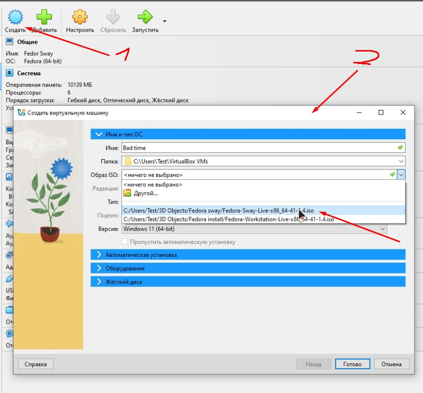
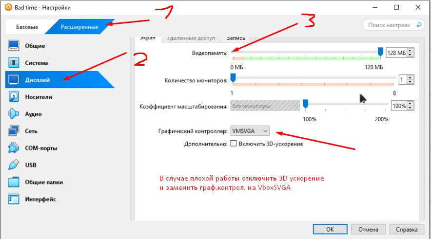
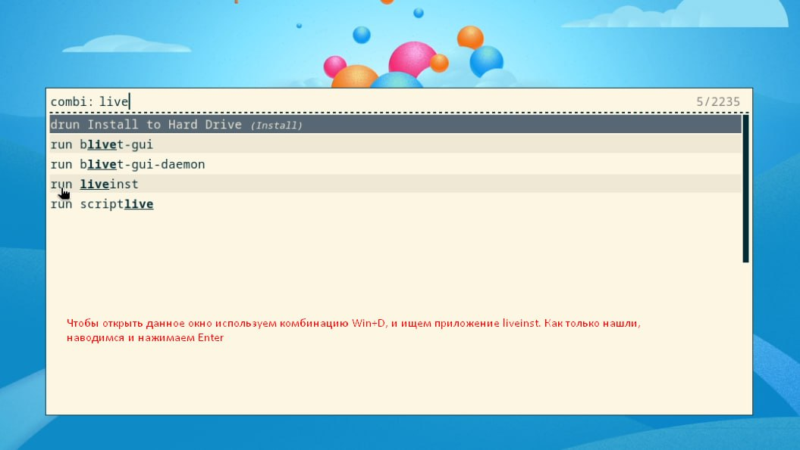
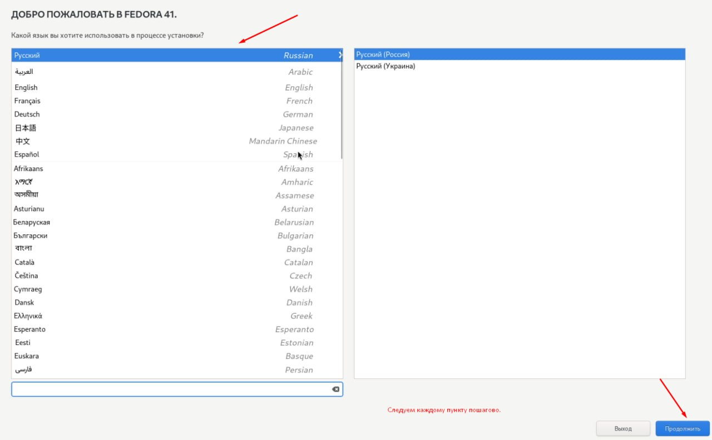
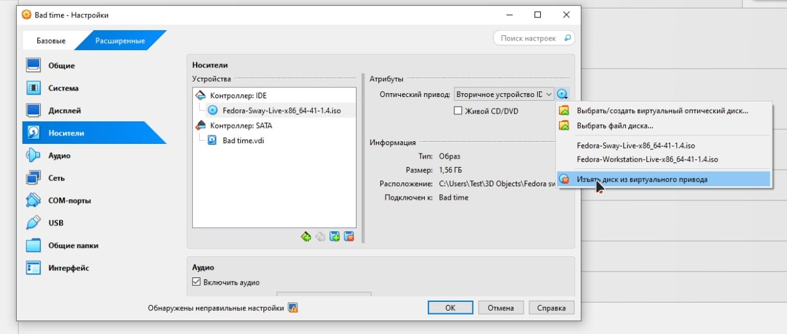
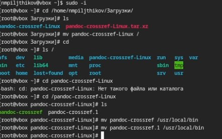

---
## Front matter
lang: ru-RU
title: Лабораторная №1
subtitle: Установка операционной системы на виртуальную машину
author:
  - Пильщиков Н.М.
institute:
  - Российский университет дружбы народов, Москва, Россия
  
date: 08 марта 2025

## i18n babel
babel-lang: russian
babel-otherlangs: english

## Formatting pdf
toc: false
toc-title: Содержание
slide_level: 2
aspectratio: 169
section-titles: true
theme: metropolis
header-includes:
 - \metroset{progressbar=frametitle,sectionpage=progressbar,numbering=fraction}
---

 

## Докладчик

:::::::::::::: {.columns align=center}
::: {.column width="70%"}

  * Пильщиков Никита Максимович
  * Студент 1-курса НММбд-03-24
  * Студент направления математика и механика
  * Российский университет дружбы народов
  * <https://github.com/nmpiljthikov/study_2024-2025_os-intro.git>

:::
::: {.column width="30%"}

:::
::::::::::::::

# Вводная часть

Научимся устанавливать виртуальную машину с операционной системой дома

## Актуальность

- актуально для людей, которые не готовы переходить на другую операционную систему, но им требуется наличие таковой

## Объект и предмет исследования

- VirtualBox и Linux Fedora Sway 41

## Цели и задачи

- Установить виртуальную машину

# Выполнение лабораторной работы

## Первичное создание и настройка

 

## Расширенные настройки

## Установка системы

Комбинация Win+D, ищем liveinst и запускаем

## Парметры системы

## Последний этап настройки

## Установка pandoc и pandoc-crossref, Tex

Устанавливаем Tex c помощью команды sudo dnf -y install texlive-scheme-full

# Выводы

Научился обращаться с репозиторием GitHub и командами git

