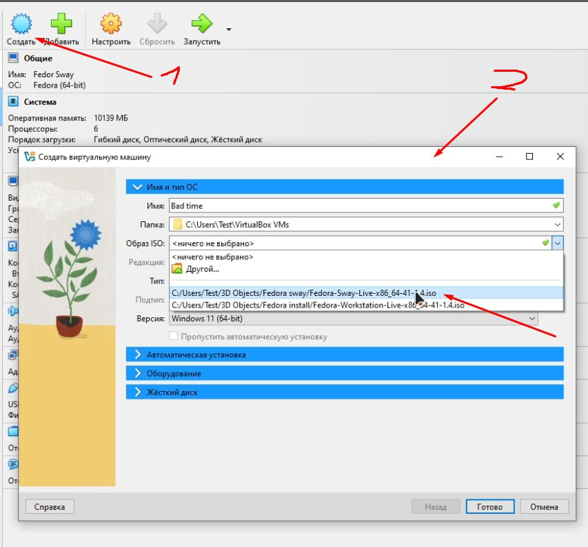
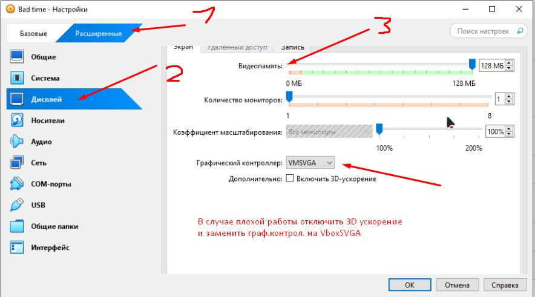
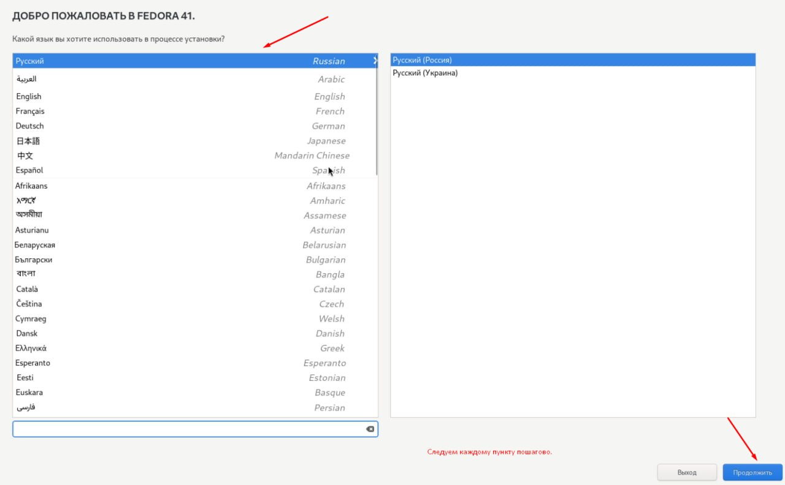
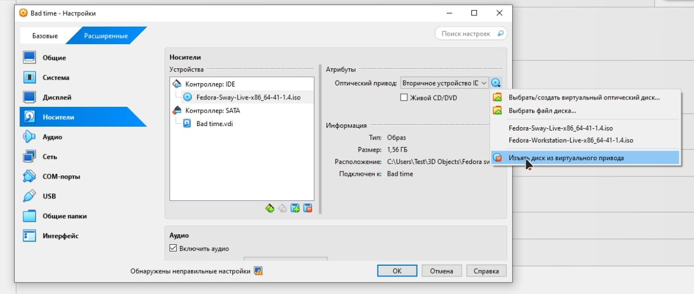
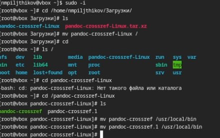

---
## Front matter
title: "Лабораторная №1"
subtitle: "Установка виртуальной машины"
author: "Пильщиков Никита Максимович"

## Generic otions
lang: ru-RU
toc-title: "Содержание"

## Bibliography
bibliography: bib/cite.bib
csl: pandoc/csl/gost-r-7-0-5-2008-numeric.csl

## Pdf output format
toc: true # Table of contents
toc-depth: 2
lof: true # List of figures
lot: true # List of tables
fontsize: 12pt
linestretch: 1.5
papersize: a4
documentclass: scrreprt
## I18n polyglossia
polyglossia-lang:
  name: russian
  options:
	- spelling=modern
	- babelshorthands=true
polyglossia-otherlangs:
  name: english
## I18n babel
babel-lang: russian
babel-otherlangs: english
## Fonts
mainfont: IBM Plex Serif
romanfont: IBM Plex Serif
sansfont: IBM Plex Sans
monofont: IBM Plex Mono
mathfont: STIX Two Math
mainfontoptions: Ligatures=Common,Ligatures=TeX,Scale=0.94
romanfontoptions: Ligatures=Common,Ligatures=TeX,Scale=0.94
sansfontoptions: Ligatures=Common,Ligatures=TeX,Scale=MatchLowercase,Scale=0.94
monofontoptions: Scale=MatchLowercase,Scale=0.94,FakeStretch=0.9
mathfontoptions:
## Biblatex
biblatex: true
biblio-style: "gost-numeric"
biblatexoptions:
  - parentracker=true
  - backend=biber
  - hyperref=auto
  - language=auto
  - autolang=other*
  - citestyle=gost-numeric
## Pandoc-crossref LaTeX customization
figureTitle: "Рис."
tableTitle: "Таблица"
listingTitle: "Листинг"
lofTitle: "Список иллюстраций"
lotTitle: "Список таблиц"
lolTitle: "Листинги"
## Misc options
indent: true
header-includes:
  - \usepackage{indentfirst}
  - \usepackage{float} # keep figures where there are in the text
  - \floatplacement{figure}{H} # keep figures where there are in the text
---

# Цель работы

Целью данной работы является приобретение практических навыков установки операционной системы на виртуальную машину, настройки минимально необходимых для дальнейшей работы сервисов.

# Выполнение лабораторной работы

Так как я работаю не в дисплейном порядок установки виртального образа отличается от лабораторной. Заходим в VirtualBox нажимаем "создать".Нам открывается окно создания образа. Выбираем имя нашей системе, далее выбираем скаченный заранее ISO, а после делаем первичную настройку в зависимости от характеристик компьютера. (рис. [-@fig:001]).

{#fig:001 width=70%}

После первичной настройки, заходим в параметр "настроить" и выбираем расширенные настройки, пункт "Дисплей". Там выставляем ползунок видеопамяти на максимум(в зависимости от характеристик вашего пк) и обращаем внимание на графический контроллер. Если Fedora не запускается, не устанавливается или там появляется чёрный экран, то меняем граф.контроллер на VboxSVGA(рис. [-@fig:002]).

{#fig:002 width=70%}

Как только запустили Fedora у нас появятся обои по умолчанию. Далее мы открываем оконный менеджер комбинацией Win+D и там ищем приложение "liveinst", которое запускаем клавишей Enter.  (рис. [-@fig:003]).

{#fig:003 width=70%}

 После появления окна установки мы выбираем язык и остальные парметры. Так как нам нужна учётная запись root мы её тоже создаём.Всё очень просто, так как всё пошагово отображается на экране.Примечение, "имя сети узла" НЕ ТРОГАТЬ!!! (рис. [-@fig:004]).

{#fig:004 width=70%}

После завершения установки выключаем машину и снова заходим в настройки.Там мы переходим вво вкладку носители и удаляем диск с установщиком iso. После чего перезаходим в систему и всё.Мы установили линукс. (рис. [-@fig:005]).

{#fig:005 width=70%}

Также в лабороторной нас просят установить пандок и пандок кроссреф.Пандок устанавливаем командой sudo dnf pandoc, командой pandoc -v смотрим его версию, под которую будем подбирать pandoc-crossref. Перейдя по ссылке из лабороторной устанавливаю pandoc-crossref нужной версии.Вписываю команду sudo -i, чтобы выполнять все функции от имени root. Перемещаю crossref  папку в корневой каталог "/" , заранее распокавав архив. Далее перемещаю файлы внутри папки pandoc-crossref в каталог /usr/local/bin. Вуаля, самое сложное позади, последним этапом будет установка Tex c помощью команды sudo dnf -y install texlive-scheme-full (рис. [-@fig:006]).

{#fig:006 width=70%}
# Выводы

Научился устанавливать виртальную машину в домашних условиях

