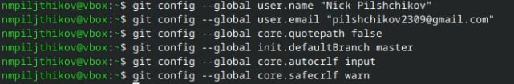
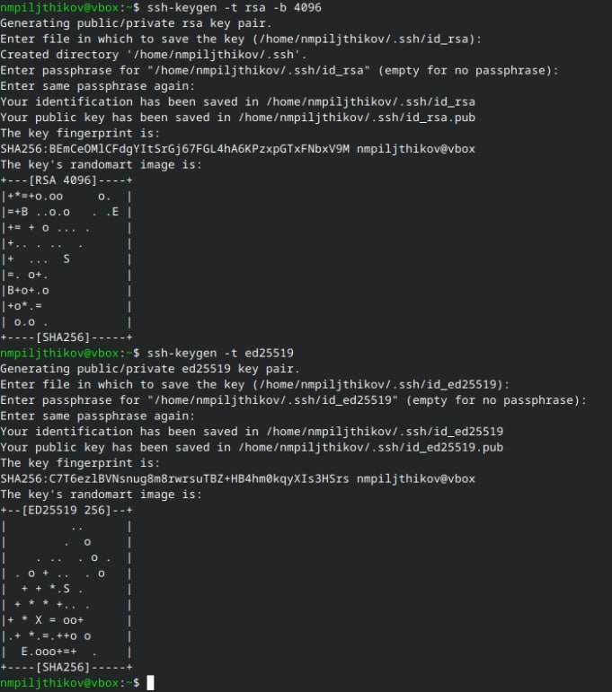
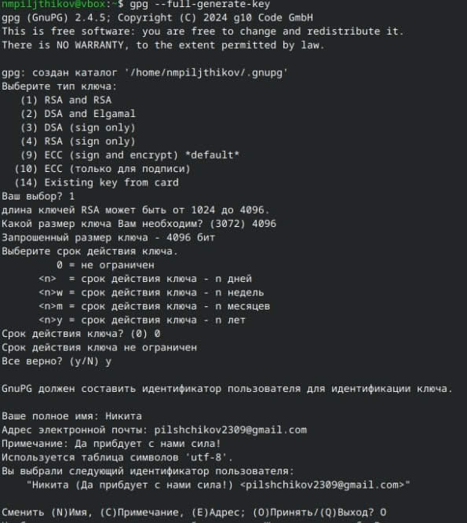
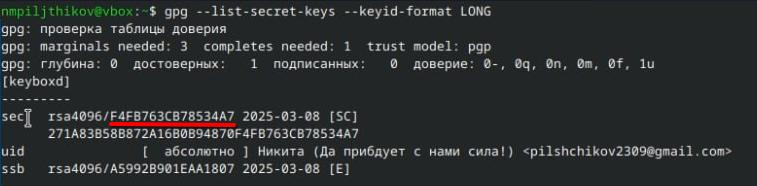
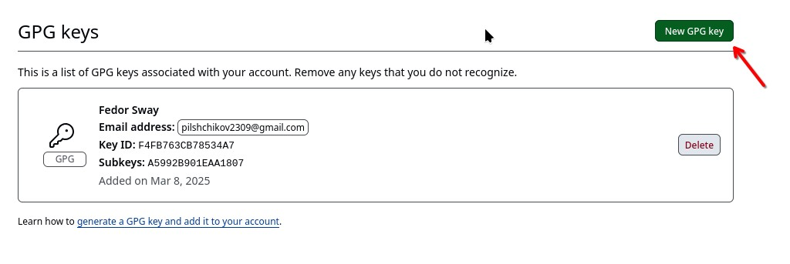
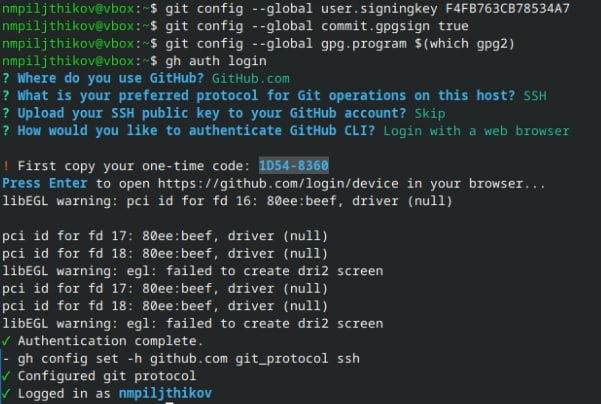
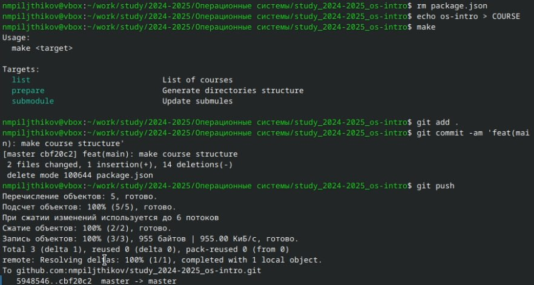
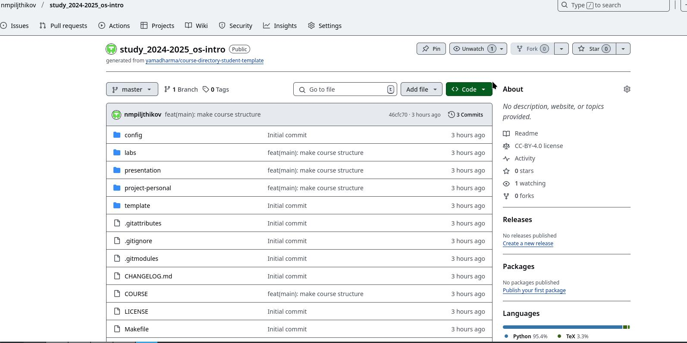

---
## Front matter
lang: ru-RU
title: Лабораторная №2
subtitle: Использование git
author:
  - Пильщиков Н.М.
institute:
  - Российский университет дружбы народов, Москва, Россия
  
date: 08 марта 2025

## i18n babel
babel-lang: russian
babel-otherlangs: english

## Formatting pdf
toc: false
toc-title: Содержание
slide_level: 2
aspectratio: 169
section-titles: true
theme: metropolis
header-includes:
 - \metroset{progressbar=frametitle,sectionpage=progressbar,numbering=fraction}
---

 

## Докладчик

:::::::::::::: {.columns align=center}
::: {.column width="70%"}

  * Пильщиков Никита Максимович
  * Студент 1-курса НММбд-03-24
  * Студент направления математика и механика
  * Российский университет дружбы народов
  * <https://github.com/nmpiljthikov/study_2024-2025_os-intro.git>

:::
::: {.column width="30%"}

:::
::::::::::::::

# Вводная часть

Научимся пользоваться git

## Актуальность

- полезно для разработчиков проектов, кодеров,создателей модификаций и приложений и тд.

## Объект и предмет исследования

- Площадка GitHub и система git

## Цели и задачи

- Изучить идеологию и применение средств контроля версий, а также освоить умения по работе с git

# Выполнение лабораторной работы

## Базовая настройка git

 

## Создание SSH ключа

## Генерация ключа PGP

## Вывод списка ключей

## Копирование PGP ключа в GitHub

## Добавляение PGP ключа на GitHub

## Настройка подписей коммитов git

## Создание репозитория и каталога курса

## Создание каталога и отправка данных на сервер

## Обновлённый репозиторий

# Выводы

## Результат

Научился обращаться с репозиторием GitHub и командами git

