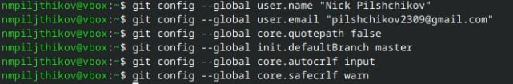
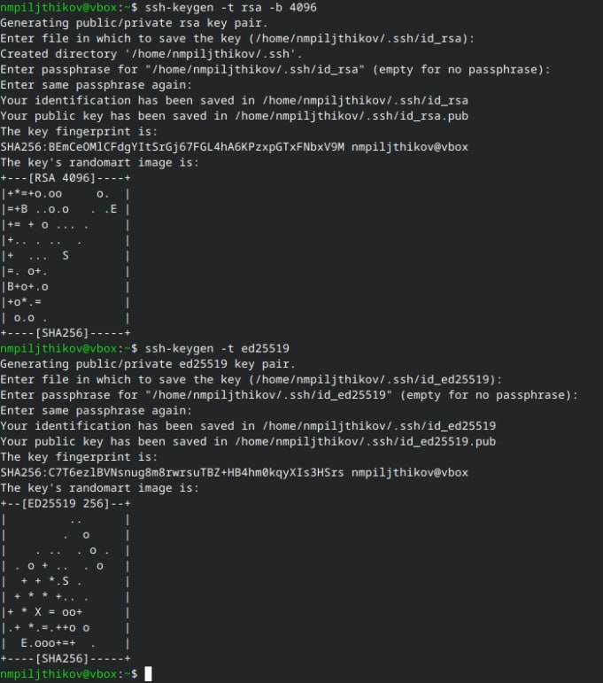
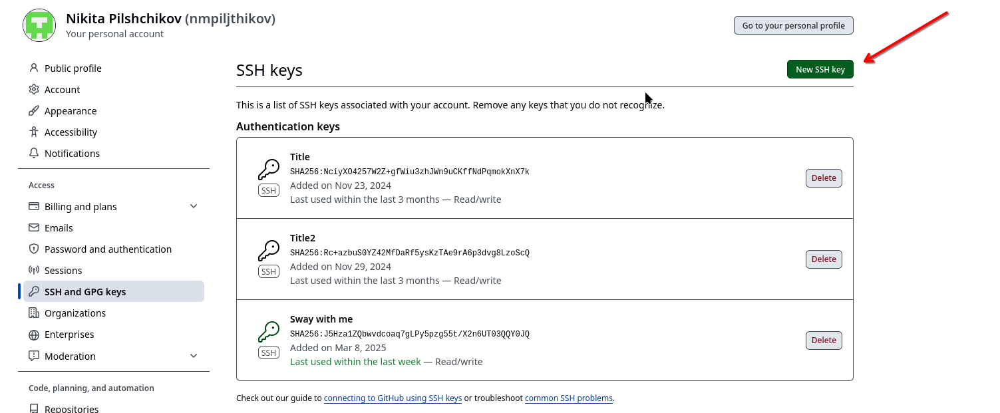
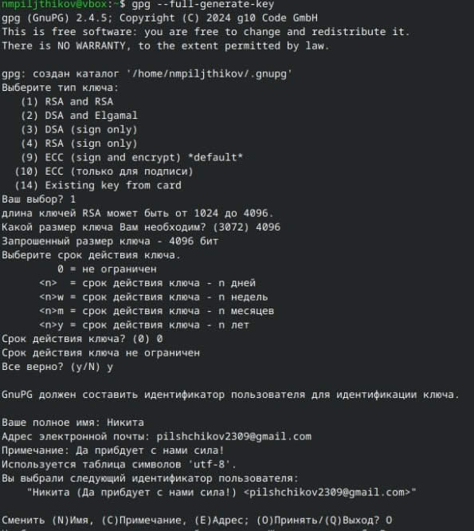
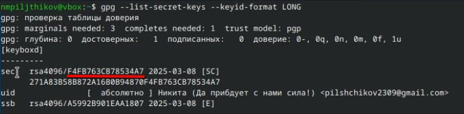
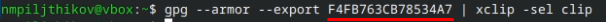
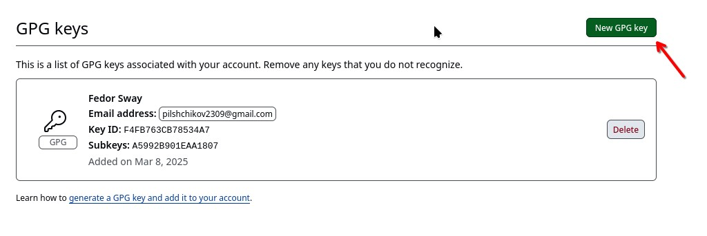
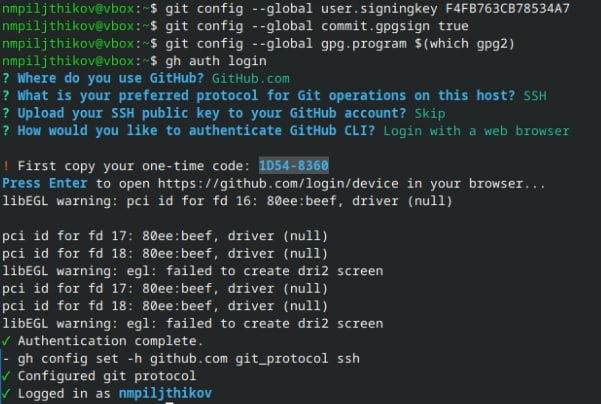
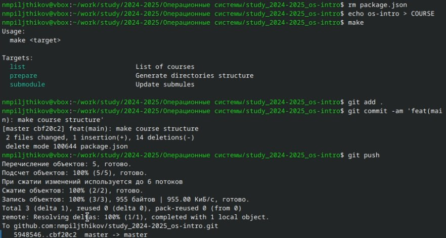
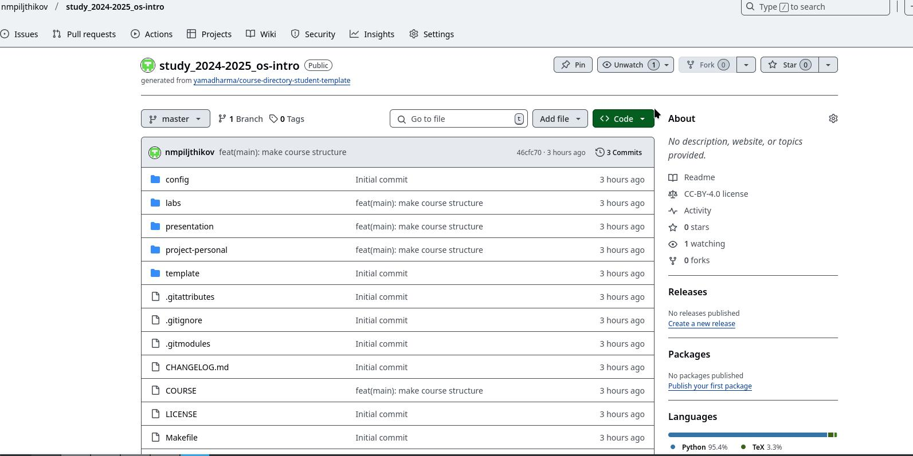

---
## Front matter
title: "Лабороторная работа №2"
subtitle: "Применение git"
author: "Пильщиков Никита Максимович"

## Generic otions
lang: ru-RU
toc-title: "Содержание"

## Bibliography
bibliography: bib/cite.bib
csl: pandoc/csl/gost-r-7-0-5-2008-numeric.csl

## Pdf output format
toc: true # Table of contents
toc-depth: 2
lof: true # List of figures
lot: true # List of tables
fontsize: 12pt
linestretch: 1.5
papersize: a4
documentclass: scrreprt
## I18n polyglossia
polyglossia-lang:
  name: russian
  options:
	- spelling=modern
	- babelshorthands=true
polyglossia-otherlangs:
  name: english
## I18n babel
babel-lang: russian
babel-otherlangs: english
## Fonts
mainfont: IBM Plex Serif
romanfont: IBM Plex Serif
sansfont: IBM Plex Sans
monofont: IBM Plex Mono
mathfont: STIX Two Math
mainfontoptions: Ligatures=Common,Ligatures=TeX,Scale=0.94
romanfontoptions: Ligatures=Common,Ligatures=TeX,Scale=0.94
sansfontoptions: Ligatures=Common,Ligatures=TeX,Scale=MatchLowercase,Scale=0.94
monofontoptions: Scale=MatchLowercase,Scale=0.94,FakeStretch=0.9
mathfontoptions:
## Biblatex
biblatex: true
biblio-style: "gost-numeric"
biblatexoptions:
  - parentracker=true
  - backend=biber
  - hyperref=auto
  - language=auto
  - autolang=other*
  - citestyle=gost-numeric
## Pandoc-crossref LaTeX customization
figureTitle: "Рис."
tableTitle: "Таблица"
listingTitle: "Листинг"
lofTitle: "Список иллюстраций"
lotTitle: "Список таблиц"
lolTitle: "Листинги"
## Misc options
indent: true
header-includes:
  - \usepackage{indentfirst}
  - \usepackage{float} # keep figures where there are in the text
  - \floatplacement{figure}{H} # keep figures where there are in the text
---

# Цель работы

Изучить идеологию и применение средств контроля версий, а также освоить умения по работе с git

# Задание

Создать базовую конфигурацию для работы с git, а также ключ SSH и ключ PGP,настроить подписи git,создать каталог для выполнения заданий

# Выполнение лабораторной работы

Так как у меня уже были установлены git и gh при обновлении пакетов, я перейду к базовой настройке git. Воспользуемся командами git config --global user.name "Name Surname" и git config --global user.email "work@mail", чтобы задать имя и email владельца соотвественно.Далее настроим ult-8 в выводе сообщений git с помощью команды git config --global core.quotepath false. Зададим имя начальной ветки git config --global init.defaultBranch master, а далее отрегулируем параметры autocrlf и safecrlf
 (рис. [-@fig:001]).

{#fig:001 width=70%}

Создадим ключи SSH двумя командами ssh-keygen -t rsa -b 4096 и ssh-keygen -t ed25519. Далее мы просто копируем ключ в буфер обмена командой  и вставляем во вкладку SSH keys в настройках вашего GitHub (рис. [-@fig:002]).

{#fig:002 width=70%}

Вставка SSH ключа в  Github (рис. [-@fig:003]).

{#fig:003 width=70%}

Сгенерируем PGP ключ и выставим настройки, указанные в лабороторной (рис. [-@fig:004]).

{#fig:004 width=70%}

Так как у меня уже был GitHub , я пропускаю этап с регистрацией и настройкой сайта, перехожу к добавлению PGP ключа на GitHub. Для начала выведем список ключей (рис. [-@fig:005]).

{#fig:005 width=70%}

Копируем ключ в буфер обмена,вставив fingerprint-отпечаток ключа в команду gpg --armor --export PGP Fingerprint | xclip -sel clip (рис. [-@fig:006]).

{#fig:006 width=70%}

Переходим по ссылке из лабораторной и вставляем наш PGP ключ в GitHub (рис. [-@fig:007]).

{#fig:007 width=70%}

Настроим подписи коммитов git (рис. [-@fig:008]).

{#fig:008 width=70%}

Создаём репозиторий курса на основе шаблона из лабораторной в GitHub по ссылке https://github.com/yamadharma/course-directory-student-template. далее переходим в терминал и создаём нужный нам каталог, куда в последствии клонируем файлы из репозитория (рис. [-@fig:009]).

{#fig:009 width=70%}

 Перйдём в каталог курса и удалим ненужные файлы командой rm package.json. Далее создадим необходимые каталоги и отправим файлы на сервер с помощью команд git (рис. [-@fig:010]).

{#fig:010 width=70%}

Репозиторий с обновлёнными файлами (рис. [-@fig:011]).

{#fig:011 width=70%}

# Выводы

Научился обращаться с репозиторием GitHub и командами git

